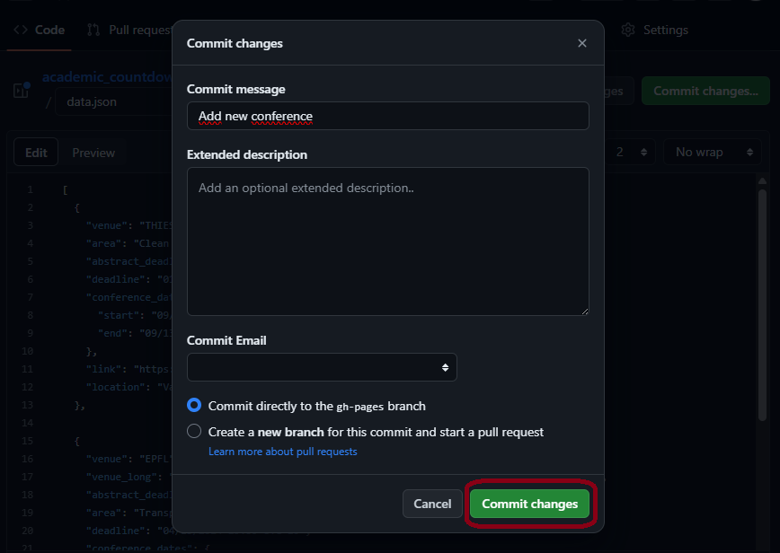

# LEGENT transport conferences countdown

## Web page

https://jrcstu.github.io/academic_countdown/

## How to update the conferences

1. Open or Create the JSON File: 
    [data/data.json](data/data.json)
2. Click in edit:
      
3. Insert a new instance, for example:
    ```json
    {
    "venue": "ECAI",
    "venue_long": "European Conference on Artificial Intelligence",
    "area": "Artificial Intelligence",
    "link": "http://ecai2020.eu/",
    "location": "Santiago de Compostela, Spain",
    "abstract_deadline": "4/19/2024 23:59 UTC-12",
    "deadline": "4/25/2024 23:59 UTC-12",
    "notification": "07/04/2024",
    "camera_ready": "08/26/2024",
    "conference_dates": {
     "start": "10/19/2024",
     "end": "10/24/2024"
    }
    }
    ```
    * The **mandatory** parameters are **venue**, **area**, and **abstract_deadline**.
    * Update Optional Parameters (if needed):
      * You can also include optional parameters such as venue_long, link, location, deadline, notification, camera_ready, and conference_dates.
    * Date Format:
      
       Ensure that the date and time values follow the specified format: month/day/year hour UTC. For example, "abstract_deadline": "4/19/2024 23:59 UTC-12".
4. Commit the change:
    * Click at the Commit changes.. button:
        
    * Write the commit message (by default you can write added new conference):
        
    * Click at the Commit changes button:
        

After that the web page will be updated automatically, please wait 30 sec or 1 minute to see the page updated.
